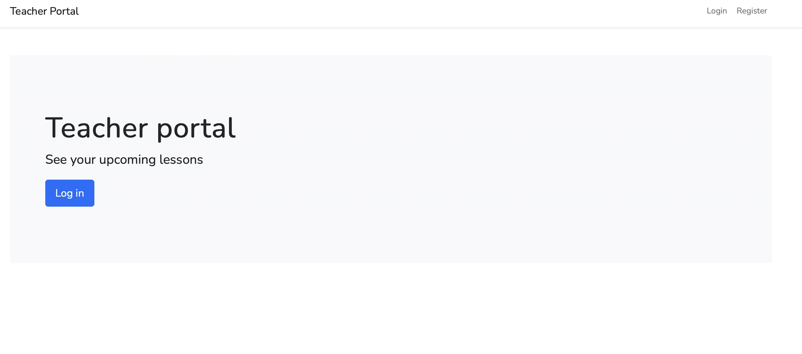
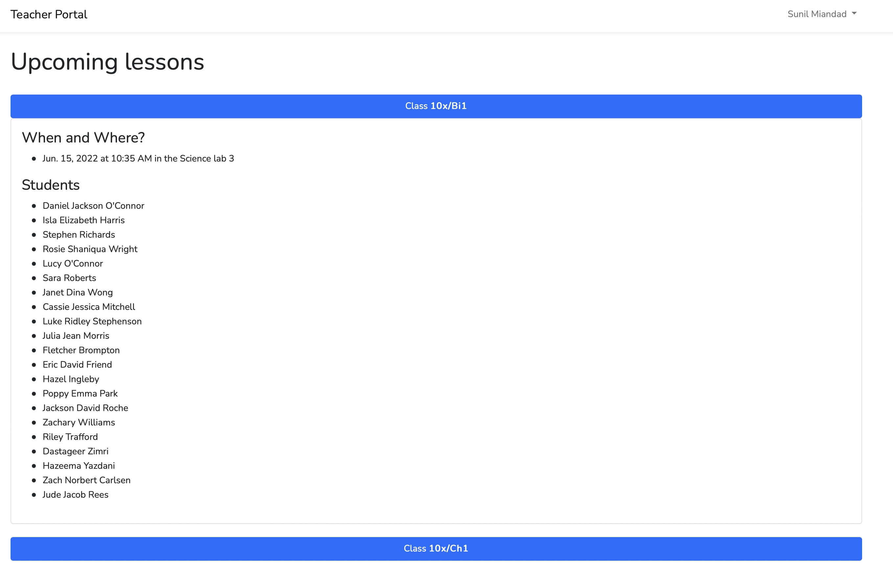

## Overview
This is a small web app that uses the sandbox Wonde API in order to show the upcoming lessons for a teacher.
The app uses Laravel 9 with a VueJS frontend.

## Welcome screen

## Upcoming lessons screen
This page is protected by middleware that detects if the user is logged in and whether the current user is an active employee of the given school. If not, the app serves a 403 page, thereby blocking any further access to the upcoming lessons page.
The page then uses Axios to make GET requests in order to retrieve the relevant lesson abd student data for the logged in employee.

